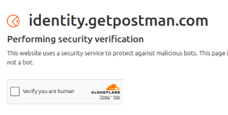

# Cơ chế qua Cloudflare `Verify you are human`

> Khi ở bước này nếu:
    

# B2: Profile Management & Initialization (Tạo Profiles)

Bước này giải thích cách hoạt động của việc khởi tạo và quản lý Chrome Profile. Trên thực tế, **bước B1 và B2 được gộp chung trong 1 tool duy nhất** (`chrome_batch_launcher.py` nằm ở thư mục `02_B2_Batch_Login`). Tuy nhiên, về mặt khái niệm, nó được chia làm 2 giai đoạn:

## Giai đoạn 1 (B1): Tạo Profile và Pre-populate Data
Khi bạn chạy `chrome_batch_launcher.py`, nó sẽ:
1. Tạo một thư mục `ChromeProfiles/<email>` cho mỗi tài khoản.
2. Thiết lập cơ sở dữ liệu Login Data của Chrome (`Login Data` SQLite) và ghi sẵn Username/Password vào đó để trình duyệt có thể Autofill.
3. Thiết lập Preferences (`Preferences` JSON) để tắt các cảnh báo mật khẩu, cho phép lưu mật khẩu tự động và chặn các popup hỏi "Lưu mật khẩu" hay "First Run".

## Tại sao lại tách B1 và B2 trong tên gọi?
Để dễ dàng quản lý quy trình:
- **B1**: Tập trung vào việc chuẩn bị môi trường và chuẩn bị Local Storage, Cookies, và Password DB. Sử dụng script `b1_create_profiles.py` để tạo trực tiếp các profile và chèn Username/Password sẵn vào cơ sở dữ liệu SQLite (`Login Data`) của trình duyệt (giống cách làm ở `_postman_edge_manager`), giúp Chrome tự động điền mật khẩu ngay khi mở.
- **B2**: Là hành động mở hàng loạt (Batch Open) các trình duyệt đã được khởi tạo để bạn thực hiện thao tác lấy Cookies hoặc test hàng loạt.

## Công cụ thực hiện
Mọi thao tác thực tế sẽ được thực hiện thông qua tool **Batch Login** ở bước B2 (`02_B2_Batch_Login`). Mời bạn chuyển sang đọc tài liệu `DOC_B2_BATCH_LOGIN.md` để tiến hành thao tác.

---

# B2: Đăng nhập Hàng loạt (Batch Login) và Xử lý Trình duyệt

Tài liệu này giải thích quy trình tự động hóa thao tác đăng nhập cho nhiều tài khoản cùng lúc mà không gây ảnh hưởng đến hiệu năng của hệ thống. File thực thi chính của bước này là `chrome_batch_launcher.py`.

## 1. Kỹ thuật Batching (Chạy theo đợt)

Do vấn đề giới hạn phần cứng (RAM/CPU), nếu mở toàn bộ (ví dụ 100) profile cùng một lúc, hệ thống sẽ bị đứng hoặc Crash. Vì vậy, ta dùng phương pháp **chạy theo đợt**:
- Hệ thống sẽ chia danh sách các tài khoản ra thành từng nhóm nhỏ, giới hạn **tối đa 6 tài khoản mở cùng lúc**.
- Script sẽ tự động bật 6 cửa sổ Chrome lên (tương ứng với 6 profile độc lập).
- Chỉ sau khi nhóm hiện tại hoàn tất việc login (và đóng trình duyệt an toàn), nhóm 6 tài khoản tiếp theo mới được kích hoạt.

## 2. Tối ưu hóa các Tham số khởi chạy (Chrome Flags)

Để đảm bảo Chrome được khởi động nhẹ nhất có thể, tránh các popup hay cảnh báo làm gián đoạn tự động hóa, script áp dụng các tham số khởi chạy (Command-line flags) sau:
- `--no-first-run`: Bỏ qua màn hình giới thiệu (Welcome Screen) của Chrome trong lần đầu tạo profile.
- `--no-default-browser-check`: Tắt thông báo hỏi đặt Chrome làm trình duyệt mặc định.
- `--disable-infobars`: Ẩn đi thanh cảnh báo màu vàng khó chịu ("Chrome is being controlled by automated test software").
- `--disable-dev-shm-usage` & `--no-sandbox`: Giúp tối ưu việc chia sẻ bộ nhớ, đặc biệt quan trọng trên môi trường Linux để không bị Crash khi mở nhiều trình duyệt.

## 3. Cơ chế Đóng Trình duyệt An toàn (Graceful Shutdown)

**Vấn đề lớn:** Nếu đóng trình duyệt bằng cách tắt đột ngột (`kill -9`), trong lần khởi chạy tiếp theo, Chrome sẽ báo lỗi tắt không an toàn và hiện lên popup **"Restore Pages?"** (Khôi phục các trang?). Popup này sẽ làm kẹt các script tự động hóa phía sau.

**Giải pháp:**
- Khi bạn đã login xong 1 nhóm 6 tài khoản và muốn chuyển sang nhóm tiếp theo, script sẽ **không** ngắt tiến trình đột ngột.
- Thay vào đó, nó gửi một tín hiệu **SIGTERM (Terminate)** tới tiến trình Chrome.
- Đây là lệnh thoát theo đúng chuẩn hệ điều hành, cho phép Chrome tự động lưu lại trạng thái tab, ghi phiên làm việc và đóng các tiến trình con một cách an toàn. Nhờ vậy, lỗi "Restore Pages" sẽ hoàn toàn biến mất ở lần chạy sau.

## 4. Tóm tắt

- File thực thi: `02_B2_Batch_Login/chrome_batch_launcher.py`
- Đầu vào: Mật khẩu mặc định và thư mục lưu Chrome Profile.
- Đầu ra: Tất cả các profile đã được đăng nhập an toàn, cookie và dữ liệu local storage được ghi đầy đủ vào thư mục Profile, sẵn sàng cho các bước tiếp theo.

----