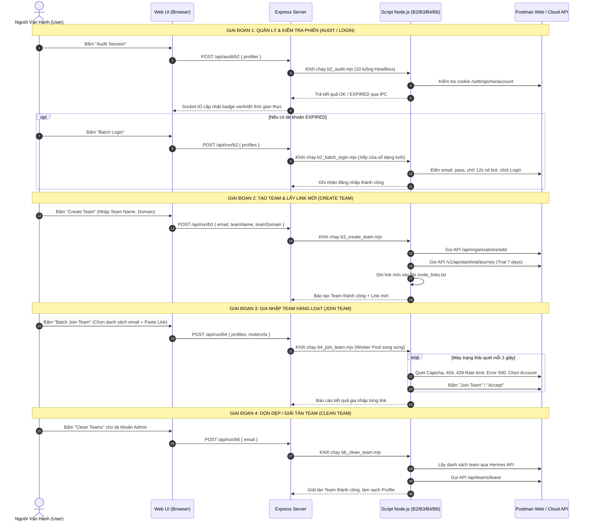

# TỔNG QUAN QUY TRÌNH HỆ THỐNG TỰ ĐỘNG HOÁ POSTMAN (OVERALL WORKFLOW)

Tài liệu này mô tả kiến trúc tổng thể, luồng dữ liệu và cách thức hoạt động của toàn bộ hệ thống tự động hoá tài khoản Postman trong dự án.

---

## 1. Sơ Đồ Kiến Trúc Tổng Thể

```mermaid
graph TD
    UI[Web UI Giao Diện Người Dùng - Port 3000] <-->|Socket.IO & HTTP REST API| Server[Node.js Express Server - server/index.js]
    
    subgraph Quản Lý Dữ Liệu
        DB[(database.json - Danh sách Profiles/Teams)]
        Settings[(settings.json - Cấu hình Luồng & Trình duyệt)]
        DiskProfiles[ChromeProfiles/<email> - Cookie & Session Cá Nhân]
        InviteFile[invite_links.txt - Lưu link mời Team]
    end

    Server <--> DB
    Server <--> Settings

    subgraph Các Kịch Bản Thực Thi Tự Động (Scripts)
        B2Audit[B2 Audit: b2_audit.mjs<br/>Quét phiên đăng nhập Headless]
        B2Login[B2 Batch Login: b2_batch_login.mjs<br/>Đăng nhập hàng loạt đa luồng]
        B3Create[B3 Create Team: b3_create_team.mjs<br/>Tạo Team & Kích hoạt Trial]
        B4Join[B4 Join Team: b4_join_team.mjs<br/>Tự động gia nhập Team State Machine]
        B6Clean[B6 Clean Team: b6_clean_team.mjs<br/>Dọn dẹp & giải tán Team]
        OpenProf[Open Profile: open_profile.mjs<br/>Mở thủ công 1 trình duyệt]
    end

    Server -->|spawn IPC| B2Audit
    Server -->|spawn IPC| B2Login
    Server -->|spawn IPC| B3Create
    Server -->|spawn IPC| B4Join
    Server -->|spawn IPC| B6Clean
    Server -->|spawn IPC| OpenProf

    B2Audit -.-> DiskProfiles
    B2Login -.-> DiskProfiles
    B3Create -.-> DiskProfiles
    B3Create -.-> InviteFile
    B4Join -.-> DiskProfiles
    B4Join -.-> InviteFile
    B6Clean -.-> DiskProfiles
```

---

## 2. Quy Trình Vận Hành Lớn (Big Workflow End-to-End)

Toàn bộ hệ thống được xây dựng theo một chu trình khép kín gồm các giai đoạn tuần tự:



---

## 3. Các Nguyên Tắc Thiết Kế Cốt Lõi (Core Principles)

### 3.1. Cô Lập Dữ Liệu Profile (Profile Isolation)
- Mỗi email được cấp một thư mục User Data riêng biệt nằm tại `ChromeProfiles/<email>`.
- Tránh tình trạng tài khoản này ghi đè Cookie hay LocalStorage của tài khoản khác.
- Giúp tài khoản giữ phiên đăng nhập vĩnh viễn trên ổ cứng.

### 3.2. Chống Phát Hiện Bot (Anti-Bot Techniques)
1. **Gỡ cờ Automation**: Tắt `--enable-automation` để trình duyệt không hiện thanh cảnh báo màu vàng "Chrome đang bị điều khiển bởi phần mềm tự động hoá".
2. **Ẩn biến `navigator.webdriver`**: Sử dụng tham số `--disable-blink-features=AutomationControlled`.
3. **Mô phỏng React Event**: Sử dụng `Object.getOwnPropertyDescriptor(HTMLInputElement.prototype, 'value').set` để React ghi nhận sự kiện gõ phím chân thực.
4. **Quy tắc trễ 12 giây**: Dừng lại 12 giây sau khi điền thông tin để máy chủ tính toán người dùng thực trước khi bấm Submit.

### 3.3. Định Vị Cửa Sổ Thông Minh (Smart Window Tiling)
- Khi mở nhiều luồng (`concurrency = 6` hoặc `12`), script tự động tính toán toạ độ `(winX, winY)` theo ma trận căn bậc hai để trải đều các cửa sổ trên màn hình mà không xếp đè lên nhau.

### 3.4. Quản Lý Đa Tiến Trình & Giao Tiếp IPC
- Máy chủ Express điều khiển các script con qua lệnh `spawn(..., { stdio: [..., 'ipc'] })`.
- Mọi câu thông báo, lỗi, tiến độ được truyền tức thì lên giao diện qua Websocket (Socket.IO).
- Người dùng có toàn quyền bấm **Tạm Dừng (Pause)**, **Tiếp Tục (Resume)**, hoặc **Huỷ (Stop)** tiến trình ngay trên giao diện web.
