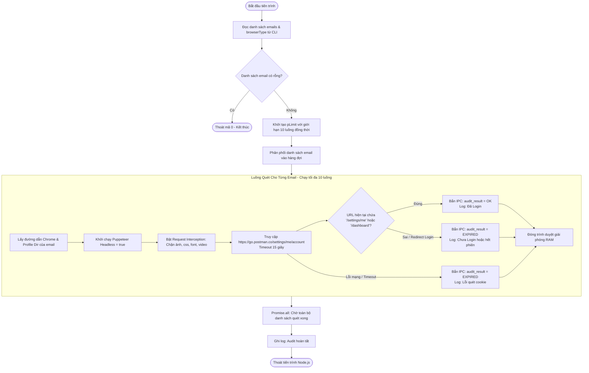

# WORKFLOW CHI TIẾT: B2 AUDIT PROFILE (`b2_audit.mjs`)

## 1. Mục Đích & Vai Trò
Kịch bản `b2_audit.mjs` có nhiệm vụ quét và kiểm tra hàng loạt tài khoản Postman trong danh sách xem tài khoản nào **còn phiên đăng nhập hợp lệ (OK)** và tài khoản nào **đã hết hạn / chưa đăng nhập (EXPIRED)**.

---

## 2. Các Tham Số Đầu Vào (Input Parameters)

| Tham Số | Vị Trí | Kiểu Dữ Liệu | Ví Dụ | Ý Nghĩa Chi Tiết |
| :--- | :--- | :--- | :--- | :--- |
| `profilesArg` | `process.argv[2]` | `string` | `"acc1@mail.com,acc2@mail.com"` | Danh sách các email tài khoản cần kiểm tra, phân cách bởi dấu phẩy `,` |
| `browserType` | `process.argv[3]` | `string` | `'chrome'` hoặc `'edge'` | Loại trình duyệt được cấu hình để quét dữ liệu |

---

## 3. Sơ Đồ Quy Trình Hoạt Động (Activity Flowchart)

---

## 4. Các Điểm Kỹ Thuật Quan Trọng

1. **Chế Độ Ẩn Hoàn Toàn (Headless: true)**:
   - Vì chỉ đọc cookie và kiểm tra redirect, không cần render giao diện ra màn hình. Chế độ này tiết kiệm 80% RAM và CPU so với chế độ có cửa sổ.
2. **Kỹ Thuật Chặn Tài Nguyên (Request Interception)**:
   - Các gói tin hình ảnh (`image`), font chữ (`font`), giao diện (`stylesheet`), và âm thanh/video (`media`) bị huỷ (`req.abort()`).
   - Tốc độ tải trang nhanh gấp 5 - 10 lần so với duyệt web thông thường.
3. **Giới Hạn Đồng Thời (Concurrency Limit = 10)**:
   - Sử dụng thư viện `p-limit(10)` để đảm bảo máy chủ không bị quá tải khi người dùng nạp vào danh sách hàng trăm profile.
4. **Cơ Chế Báo Cáo Thời Gian Thực (Real-time IPC)**:
   - Dùng `process.send({ type: 'audit_result', data: { email, status } })` giúp Web UI nhận diện ngay lập tức và đổi màu badge trạng thái của tài khoản trên bảng danh sách mà không cần đợi quét xong toàn bộ.
