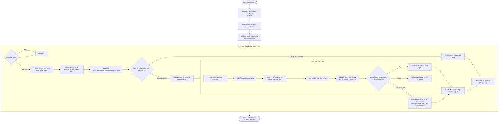

# WORKFLOW CHI TIẾT: B2 BATCH LOGIN (`b2_batch_login.mjs`)

## 1. Mục Đích & Vai Trò
Kịch bản `b2_batch_login.mjs` thực hiện việc tự động đăng nhập hàng loạt tài khoản Postman với giao diện trực quan, hỗ trợ xếp cửa sổ thông minh và có cơ chế chờ người dùng thao tác tay nếu tự động điền thất bại.

---

## 2. Các Tham Số Đầu Vào (Input Parameters)

| Tham Số | Vị Trí | Kiểu Dữ Liệu | Giá Trị Mặc Định | Ý Nghĩa Chi Tiết |
| :--- | :--- | :--- | :--- | :--- |
| `profiles` | `process.argv[2]` | `string` | Bắt buộc | Danh sách các email tài khoản cách nhau bởi dấu phẩy `,` |
| `concurrency` | `process.argv[3]` | `number` | `6` | Số lượng cửa sổ trình duyệt mở đồng thời cùng một lúc |
| `browserType` | `process.argv[4]` | `string` | `'chrome'` | Loại trình duyệt sử dụng (`'chrome'` hoặc `'edge'`) |
| `isHeadful` | `process.argv[5]` | `string` | `'headful'` | Khác `'headless'` sẽ hiển thị cửa sổ trực quan |

---

## 3. Sơ Đồ Quy Trình Hoạt Động (Activity Flowchart)



---

## 4. Các Điểm Kỹ Thuật Quan Trọng

### 4.1. Thuật Toán Xếp Cửa Sổ Dạng Lưới (Smart Window Tiling)
```javascript
const columns = Math.ceil(Math.sqrt(concurrency));
const winX = (currentIndex % columns) * 350;
const winY = Math.floor(currentIndex / columns) * 250;
```
- Tự động chia màn hình thành lưới kích thước `columns` x `rows`.
- Cửa sổ mở ra ở toạ độ xác định, không đè lấp lên nhau, giúp người vận hành quan sát đồng thời 6-12 luồng hoạt động cùng lúc.

### 4.2. Thời Gian Chờ Vàng 12 Giây
- Hệ thống phòng thủ của Postman (Akamai/Cloudflare Bot Management) tính toán thời gian người dùng tương tác với form.
- Thao tác gõ xong bấm ngay lập tức (< 2 giây) sẽ bị kích hoạt Captcha hoặc nút `#sign-in-btn` chưa chuyển sang trạng thái hợp lệ. Chờ 12s là chìa khoá để đạt tỉ lệ đăng nhập thành công cao.

### 4.3. Cơ Chế Dự Phòng Chờ Thao Tác Tay (Manual Fallback)
- Nếu vì lý do mạng chập chờn hoặc xuất hiện Captcha hình ảnh phức tạp khiến tự động điền 3 lần thất bại, script không thoát lỗi ngay mà treo cửa sổ lại bằng `page.waitForFunction(...)` trong 10 phút.
- Người dùng chỉ cần click chuột giải quyết trên màn hình, script sẽ phát hiện URL chuyển trang và tự động tiếp tục các bước sau.
