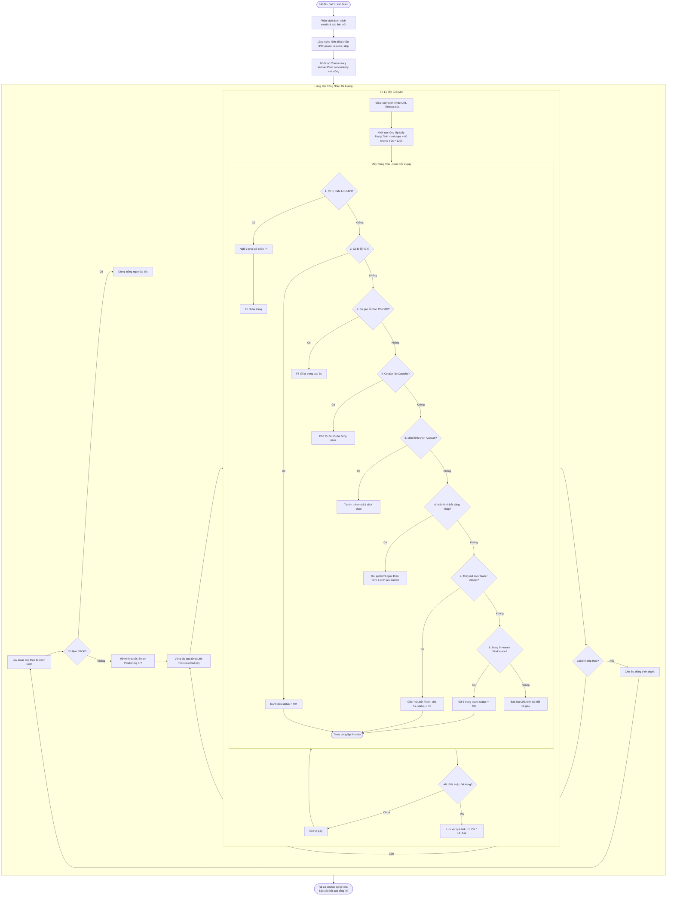

# WORKFLOW CHI TIẾT: B4 BATCH JOIN TEAM (`b4_join_team.mjs`)

## 1. Mục Đích & Vai Trò
Kịch bản `b4_join_team.mjs` là **trung tâm của toàn bộ hệ sinh thái**. Nó đảm nhiệm việc đưa đồng loạt các tài khoản Postman trong danh sách tham gia vào một hoặc nhiều Team thông qua các liên kết mời (Invite Links), đồng thời tự động nhận diện và xử lý mọi biến cố phát sinh trong quá trình duyệt web.

---

## 2. Các Tham Số Đầu Vào (Input Parameters)

| Tham Số | Vị Trí | Kiểu Dữ Liệu | Ví Dụ | Ý Nghĩa Chi Tiết |
| :--- | :--- | :--- | :--- | :--- |
| `profiles` | `process.argv[2]` | `string` | `"u1@mail.com,u2@mail.com"` | Danh sách các email tài khoản cần join team |
| `inviteUrlsRaw`| `process.argv[3]` | `string` | `"https://...|||https://..."` | Một hoặc nhiều link mời, phân tách bằng chuỗi `\|\|\|` |
| `concurrency` | `process.argv[4]` | `number` | `6` | Số lượng trình duyệt mở đồng thời cùng lúc |
| `browserType` | `process.argv[5]` | `string` | `'chrome'` | Loại trình duyệt (`'chrome'` hoặc `'edge'`) |

---

## 3. Sơ Đồ Quy Trình Hoạt Động (Activity Flowchart)

---

## 4. Bảng Tra Cứu 8 Trạng Thái Của State Machine

| STT | Trạng Thái Nhận Diện | Dấu Hiệu Nhận Diện | Hành Động Xử Lý Của Tool |
| :---: | :--- | :--- | :--- |
| **1** | **Rate Limit (HTTP 429)** | Tiêu đề hoặc nội dung chứa `"429"`, `"Too Many Requests"`, `"Rate-limit exceeded"` | Báo cảnh báo, tạm dừng luồng **3 phút (180,000ms)** để máy chủ Postman gỡ hạn chế IP, sau đó tự F5 tải lại |
| **2** | **Link Hỏng (HTTP 404)** | Tiêu đề hoặc nội dung chứa `"404"`, `"Page not found"`, `"This invite link is invalid"` | Báo lỗi ngay lập tức, gán kết quả `404 Not Found` và chuyển sang link mời kế tiếp, không chờ vô ích |
| **3** | **Lỗi Con Chó (HTTP 500)** | Nội dung trang chứa `"Something went wrong"`, `"500 Internal Server Error"`, `"Error 500"` | Tự động F5 tải lại trang (`page.reload`) sau 3 giây để Postman điều hướng sang node máy chủ hoạt động |
| **4** | **Xác Thực Captcha** | Tiêu đề `"Just a moment..."`, nội dung `"Verify you are human"` | Không can thiệp thô bạo, chờ tối đa 15 giây để Cloudflare tự động nhận diện cookie sạch và cho qua |
| **5** | **Màn Hình Chọn Tài Khoản** | URL `/accounts` hoặc xuất hiện các thẻ chứa danh sách email đã lưu trong máy | Quét cây DOM, tìm thẻ văn bản chứa đúng email đang chạy, tìm thẻ cha có con trỏ pointer hoặc onclick để bấm chọn |
| **6** | **Bắt Đăng Nhập Lại** | URL chứa `/login` hoặc `identity.getpostman.com` | Gọi hàm `performLogin()`: Điền email, password bằng React prototype setter, dừng 12 giây rồi click Sign In |
| **7** | **Nút Tham Gia Team** | Xuất hiện thẻ `<button>` chứa chữ `"Join Team"` hoặc `"Accept"` và đang hiển thị (`offsetParent !== null`) | Click nút tham gia, chờ 5 giây để Postman lưu dữ liệu phiên và chuyển trang. Đánh dấu kết quả `OK` |
| **8** | **Đã Vào Không Gian Làm Việc** | URL chứa `/home` hoặc `/workspace` | Nhận diện tài khoản đã là thành viên của Team này. Đánh dấu `OK` và thoát |

---

## 5. Cơ Chế Điều Khiển Từ Web UI (IPC Control)

Script luôn lắng nghe các thông điệp qua kênh IPC:
1. **`cmd: 'pause'`**: Đặt cờ `isPaused = true`. Toàn bộ các luồng worker đang chạy sẽ dừng lại tại chỗ, giữ nguyên các cửa sổ trên màn hình để người dùng kiểm tra.
2. **`cmd: 'resume'`**: Đặt cờ `isPaused = false`. Các luồng worker tiếp tục chạy tiếp tục từ vị trí dừng.
3. **`cmd: 'stop'`**: Đặt cờ `isStopped = true`. Ngắt toàn bộ vòng lặp, gửi thông báo huỷ và thoát tiến trình Node.js an toàn.
