# WORKFLOW CHI TIẾT: B6 CLEAN TEAMS (`b6_clean_team.mjs`)

## 1. Mục Đích & Vai Trò
Kịch bản `b6_clean_team.mjs` có nhiệm vụ dọn dẹp các Team rác hoặc Team hết hạn trên tài khoản Postman của Admin. Bằng cách rời khỏi (Leave Team) khi là Admin duy nhất, Team đó sẽ tự động bị Postman giải tán và xoá vĩnh viễn, giúp tài khoản sạch sẽ để tiếp tục tạo các Team mới.

---

## 2. Các Tham Số Đầu Vào (Input Parameters)

| Tham Số | Vị Trí | Kiểu Dữ Liệu | Ví Dụ | Ý Nghĩa Chi Tiết |
| :--- | :--- | :--- | :--- | :--- |
| `admin_email` | `process.argv[2]` | `string` | `"admin@domain.com"` | Email tài khoản quản trị viên cần dọn dẹp |
| `browserType` | `process.argv[3]` | `string` | `'chrome'` | Loại trình duyệt (`'chrome'` hoặc `'edge'`) |
| `isHeadful` | `process.argv[4]` | `string` | `'headful'` | Khác `'headless'` sẽ hiển thị cửa sổ trực quan |

---

## 3. Sơ Đồ Quy Trình Hoạt Động (Activity Flowchart)

```mermaid
flowchart TD
    Start([Bắt đầu Clean Team]) --> ReadArgs[Đọc tham số: admin_email, browserType, isHeadful]
    ReadArgs --> LaunchBrowser[Mở trình duyệt gắn Profile của admin_email]
    LaunchBrowser --> NavAccount[Truy cập https://go.postman.co/settings/me/account<br/>để nạp Session & Cookie]
    
    NavAccount --> CheckAuth{Cookie còn hợp lệ?}
    CheckAuth -- Không (Bị về /login) --> LogErrAuth[Báo lỗi: Yêu cầu chạy B2 Login trước] --> Terminate([Đóng trình duyệt & Thoát])
    
    CheckAuth -- Có (Đã Login) --> CallHermesWS[Gọi API Hermes: GET /workspaces]
    
    subgraph APIWorkspaces [Lấy Danh Sách Workspaces]
        PostProxyWS[POST /_api/ws/proxy<br/>service: 'hermes'<br/>path: '/workspaces']
    end
    
    CallHermesWS --> PostProxyWS
    PostProxyWS --> CheckHasTeam{Có workspace loại 'team' không?}
    CheckHasTeam -- Không --> LogNoTeam[Tài khoản không thuộc Team nào] --> CloseSuccess([Đóng trình duyệt & Thoát])
    
    CheckHasTeam -- Có --> CallHermesTeams[Gọi API Hermes: GET /api/teams/me]
    
    subgraph APITeams [Lấy Toàn Bộ Teams Người Dùng Tham Gia]
        PostProxyTeams[POST /_api/ws/proxy<br/>service: 'hermes'<br/>path: '/api/teams/me']
    end
    
    CallHermesTeams --> PostProxyTeams
    PostProxyTeams --> LoopTeams[Vòng lặp qua từng Team trong danh sách myTeams.data]
    
    subgraph ProcessEachTeam [Xử Lý Từng Team]
        CheckAdmin{Vai trò role === 'admin'?}
        CheckAdmin -- Không --> SkipTeam[Bỏ qua team này vì không phải quyền Admin]
        CheckAdmin -- Có --> LeaveTeamAPI[Gọi API Rời Team /api/teams/leave]
        
        subgraph APILeave [API Rời Team]
            PostProxyLeave[POST /_api/ws/proxy<br/>Header: x-entity-team-id = team.id<br/>service: 'hermes'<br/>path: '/api/teams/leave']
        end
        
        LeaveTeamAPI --> PostProxyLeave
        PostProxyLeave --> CheckLeaveStatus{Mã HTTP = 200?}
        CheckLeaveStatus -- Có --> LogLeaveOK[Báo đã rời & giải tán Team thành công]
        CheckLeaveStatus -- Không --> LogLeaveFail[Báo lỗi không thể rời Team]
    end

    LoopTeams --> ProcessEachTeam
    ProcessEachTeam --> NextTeam{Còn Team tiếp theo?}
    NextTeam -- Còn --> LoopTeams
    NextTeam -- Hết --> FinishLog[Báo hoàn tất dọn dẹp toàn bộ Team]
    FinishLog --> WaitHeadful[Nếu headful: Chờ 4s quan sát]
    WaitHeadful --> CloseSuccess
```

---

## 4. Các Điểm Kỹ Thuật Quan Trọng

### 4.1. Microservice Hermes của Postman
- Postman tách riêng việc quản lý phân quyền không gian làm việc cho một service nội bộ tên là **Hermes**.
- Script tận dụng 2 endpoint chính:
  1. `GET /workspaces`: Kiểm tra nhanh xem tài khoản có đang ở trong workspace thuộc tổ chức nào không.
  2. `GET /api/teams/me`: Lấy cấu trúc chi tiết danh sách tất cả các Team kèm quyền hạn (`role: 'admin' | 'member'`).

### 4.2. Cơ Chế Tự Động Xoá Team Khi Admin Cuối Cùng Rời Đi
- Thay vì gọi API xoá đội nhóm phức tạp đòi hỏi nhiều bước xác nhận mật khẩu, việc gửi lệnh `POST /api/teams/leave` cho phép Admin rời đi.
- Máy chủ Postman được thiết kế theo quy tắc: Một Team không còn quản trị viên sẽ tự động được hệ thống đánh dấu giải tán và xoá vĩnh viễn dữ liệu liên quan.
