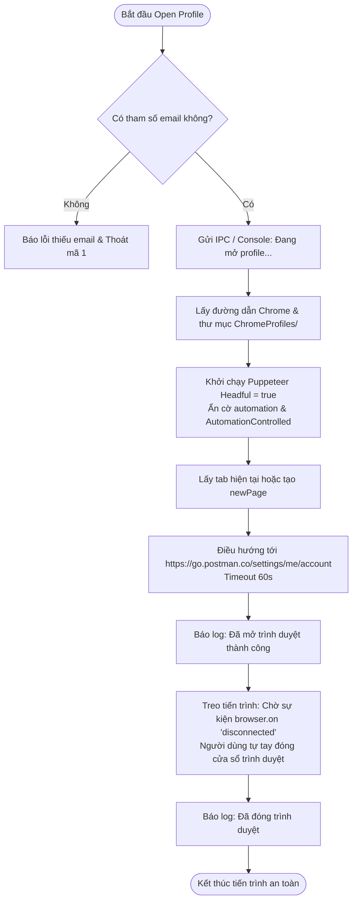

# WORKFLOW CHI TIẾT: OPEN PROFILE THỦ CÔNG (`open_profile.mjs`)

## 1. Mục Đích & Vai Trò
Kịch bản `open_profile.mjs` dùng để mở một cửa sổ trình duyệt Chrome/Edge độc lập gắn với thư mục Profile của một tài khoản Postman xác định, giúp người vận hành có thể can thiệp bằng tay (Manual Inspection), xử lý sự cố hoặc kiểm tra trực quan.

---

## 2. Các Tham Số Đầu Vào (Input Parameters)

| Tham Số | Vị Trí | Kiểu Dữ Liệu | Ví Dụ | Ý Nghĩa Chi Tiết |
| :--- | :--- | :--- | :--- | :--- |
| `email` | `process.argv[2]` | `string` | `"user@example.com"` | Địa chỉ email của tài khoản cần mở profile (bắt buộc) |
| `browserType` | `process.argv[3]` | `string` | `'chrome'` | Loại trình duyệt (`'chrome'` hoặc `'edge'`, mặc định `'chrome'`) |

---

## 3. Sơ Đồ Quy Trình Hoạt Động (Activity Flowchart)



---

## 4. Các Điểm Kỹ Thuật Quan Trọng

### 4.1. Cơ Chế Treo Giữ Tiến Trình (Keep-Alive Pattern)
```javascript
await new Promise(resolve => browser.on('disconnected', resolve));
```
- Khi chạy script Node.js thông thường, nếu không có tác vụ nào đang chờ thì Node.js sẽ tự động kết thúc (exit).
- Bằng cách tạo một Promise chỉ giải quyết khi nhận được sự kiện `disconnected` từ Puppeteer, tiến trình Node.js sẽ luôn sống chừng nào cửa sổ trình duyệt vẫn còn đang mở trên màn hình máy tính của người dùng.

### 4.2. Bảo Lưu Hoàn Toàn Dữ Liệu
- Mọi thao tác do người dùng thực hiện (đổi mật khẩu, vượt captcha, cập nhật thông tin cá nhân, cài đặt 2FA) đều được trình duyệt ghi thẳng xuống thư mục `ChromeProfiles/<email>`.
- Các script tự động khác chạy sau đó sẽ thừa hưởng 100% dữ liệu phiên làm việc này.
