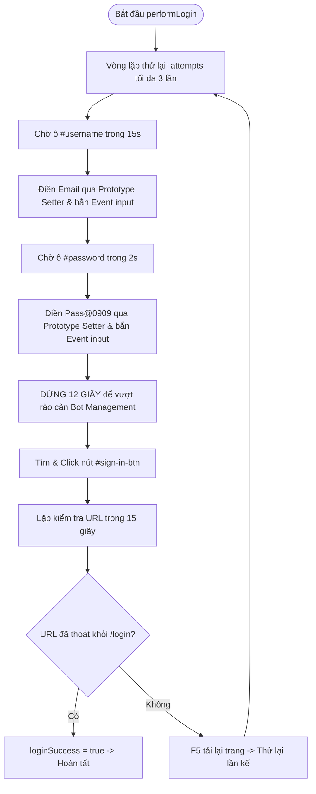

# TÀI LIỆU KỸ THUẬT & WORKFLOW TIỆN ÍCH: `postman_utils.mjs`

## 1. Mục Đích & Tổng Quan
Module `postman_utils.mjs` đóng vai trò là thư viện dùng chung (Shared Utilities) giải quyết tất cả các vấn đề hóc búa liên quan đến chống phát hiện bot (Anti-bot detection), vượt lỗi hệ thống và tự động hoá thao tác trên giao diện Postman Web.

---

## 2. Chi Tiết Các Hàm Tiện Ích

### 2.1. `sleep(ms)`
```javascript
export const sleep = (ms) => new Promise(r => setTimeout(r, ms));
```
- **Mục đích**: Tạm dừng luồng mà không làm nghẽn Event Loop của Node.js.
- **Tham số**: `ms` (số mili-giây cần ngủ, ví dụ: `sleep(3000)` = 3 giây).

---

### 2.2. `performLogin(page, email, log)`
Quy trình điền form đăng nhập tự động chuẩn React.



> **Tại sao phải dùng Prototype Setter?**
> React 16+ ghi đè thuộc tính `.value` của các thẻ input bằng hệ thống Synthetic Event riêng. Nếu chỉ gán `element.value = "abc"`, state bên trong React sẽ không hề thay đổi và nút Sign In sẽ không nhận diện được dữ liệu. Bằng cách gọi setter từ `HTMLInputElement.prototype`, dữ liệu được đồng bộ chính xác 100%.

---

### 2.3. `checkAndHandleDogError(page, log, profileName)`
- **Vấn đề**: Khi tải lượng truy cập lớn, cụm máy chủ Postman thỉnh thoảng trả về mã lỗi HTTP 500 kèm hình vẽ chú chó du hành vũ trụ ("Something went wrong", "Error 500").
- **Xử lý**: Hàm quét nội dung chữ trên body, nếu phát hiện sẽ ngay lập tức gọi `page.reload({ waitUntil: 'domcontentloaded' })` sau 3 giây để hệ thống tự cân bằng tải sang máy chủ khác.

---

### 2.4. `checkAndHandleCaptcha(page, log, profileName)`
- **Vấn đề**: Rào cản Cloudflare Turnstile ("Just a moment...", "Verify you are human", "Performing security verification") xuất hiện ô checkbox tương tác `[ ] Verify you are human`.
- **Tại sao trước đây phải đợi 15s?**: Trước đây giả định là dạng Silent Cloudflare (chờ 5-10s nó tự chuyển nếu cookie sạch). Nhưng thực tế gần đây Postman bắt buộc phải tương tác (Interactive Turnstile).
- **Cơ chế Tự Động Click (Mới nâng cấp)**:
  1. Ngay khi phát hiện, hàm định vị Iframe của Cloudflare Turnstile (`challenges.cloudflare.com`).
  2. Lấy toạ độ BoundingBox của iframe (`box.x + 28`, `box.y + box.height/2`) và di chuyển chuột ảo để click thẳng vào ô vuông `[ ] Verify you are human`.
  3. Đồng thời quét qua các frame con để click trực tiếp vào thẻ input/label nếu cùng ngữ cảnh.
  4. Chờ 3-5 giây để nhận diện tích xanh và chuyển hướng sang màn hình tiếp theo.

---

### 2.5. `check404(page, log, profileName)`
- **Vấn đề**: Link mời tham gia Team đã hết hạn hoặc bị người quản trị thu hồi.
- **Xử lý**: Quét các chuỗi nhận diện `"404"`, `"Page not found"`, `"This invite link is invalid"`. Nếu phát hiện, báo lỗi và trả về `true` để kịch bản chính huỷ bỏ link này ngay lập tức, tránh phí phạm 120s chờ đợi vô ích.

---

### 2.6. `checkRateLimit(page, log, profileName)`
- **Vấn đề**: Gửi quá nhiều request từ một địa chỉ IP khiến máy chủ Postman kích hoạt chặn giới hạn lưu lượng (HTTP 429 Too Many Requests).
- **Xử lý**: Nhận diện thông báo `"Rate-limit exceeded"` hoặc `"Too Many Requests"`. Tự động dừng luồng lại **3 phút (180 giây)** để giải phóng điểm phạt IP trước khi tải lại trang tiếp tục làm việc.
