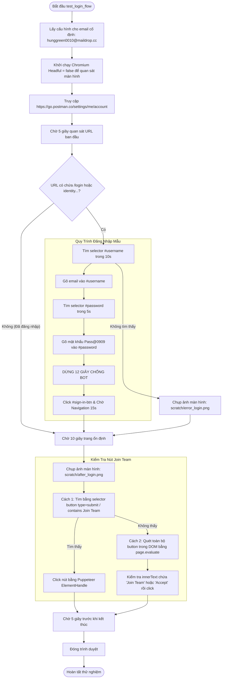

# WORKFLOW CHI TIẾT: TEST LOGIN FLOW ĐỘC LẬP (`test_login_flow.mjs`)

## 1. Mục Đích & Vai Trò
Kịch bản `test_login_flow.mjs` là một công cụ thử nghiệm (Testing / Prototyping Script) được thiết kế để chạy độc lập từ dòng lệnh mà không cần thông qua giao diện Web UI hoặc Server Express. 
Mục đích chính:
1. Thử nghiệm thuật toán điền form đăng nhập tự động trên một tài khoản mẫu cố định (`hunggreen0010@maildrop.cc`).
2. Chụp ảnh màn hình (`screenshot`) tại các thời điểm then chốt để phục vụ phân tích lỗi và gỡ lỗi giao diện (UI debugging).
3. Đánh giá độ tin cậy của việc tìm và nhấn nút "Join Team" / "Accept" bằng 2 phương pháp khác nhau.

---

## 2. Sơ Đồ Quy Trình Hoạt Động (Activity Flowchart)

---

## 3. Các Điểm Kỹ Thuật Quan Trọng

### 3.1. Chẩn Đoán Lỗi Bằng Ảnh Màn Hình (Visual Snapshots)
- Lưu ảnh trực tiếp vào thư mục `scratch/`:
  - `scratch/error_login.png`: Được chụp nếu không tìm thấy ô nhập tài khoản (ví dụ bị vướng màn hình Captcha hoặc sập server).
  - `scratch/after_login.png`: Được chụp sau khi hoàn tất bước submit để kiểm tra xem đã vào được màn hình nào.

### 3.2. So Sánh 2 Kỹ Thuật Tương Tác DOM
1. **Puppeteer Handle (`page.$`)**:
   - Tốt khi selector cố định và phần tử là thẻ chuẩn.
   - Dễ gặp vấn đề nếu nút bị bọc trong Shadow DOM hoặc CSS module.
2. **Ngữ Cảnh Trình Duyệt (`page.evaluate`)**:
   - Dùng mã JavaScript thuần chạy trực tiếp trong trang web.
   - Duyệt qua `Array.from(document.querySelectorAll('button'))` và kiểm tra `.innerText`. Cách này có độ tương thích cao hơn rất nhiều khi giao diện Postman cập nhật.
